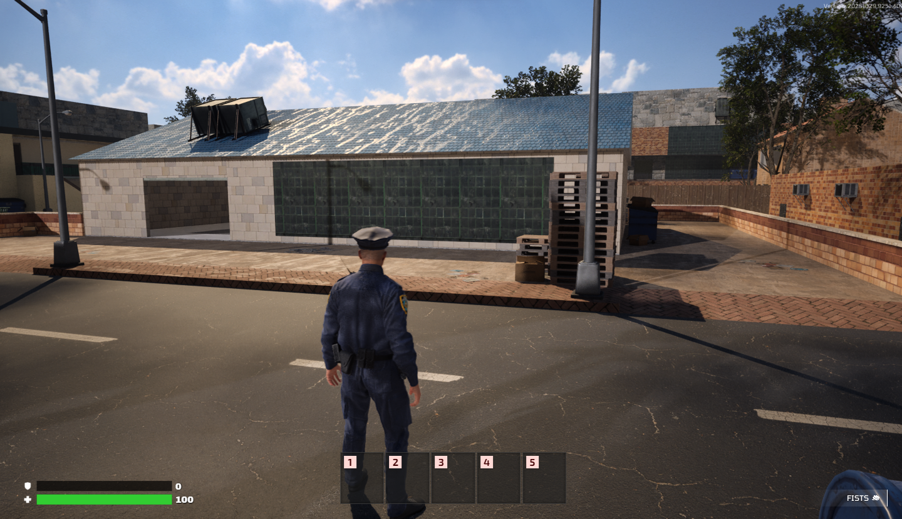

# Eyal_FortniteHUD - Helix

A custom Fortnite-style HUD script for the Helix game

## Screenshots



## Installation

1. Download or clone this repository
2. Place the `Eyal_FortniteHUD` folder in your server's `scripts` directory
3. add `Eyal_FortniteHUD` to your config.json file. (like the example)
```json
{
  "packages": [
    "qb-core",
    "qb-interior",
    "qb-multicharacter",
    "qb-spawn",
    "qb-target",
    "qb-inventory",
    "qb-apartments",
    "Eyal_FortniteHUD",
    "qb-menu",
    "qb-input",
    "qb-banking",
    "qb-cityhall",
    "qb-shops",
    "qb-management",
    "qb-chat"
  ]
}
```

## File Structure

```
Eyal_FortniteHUD/
├── client.lua          # Main client-side script logic
├── package.json        # Script configuration
├── README.md          # This file
└── html/
    ├── index.html     # HUD interface
    ├── script.js      # Frontend JavaScript logic
    ├── style.css      # HUD styling
    └── images/
        ├── armor.png  # Armor icon
        └── health.png # Health icon
```

## Dependencies

- **Helix**: Game where the script is running on
- **QBCore**: Used for player data management

## Compatibility

- Helix (qbcore)

## Support

If you encounter any issues or have suggestions for improvements, please create an issue in the repository or contact eyalgreen

## License

This project is open source. Feel free to modify and redistribute according to your needs.

---

**Created by Eyal** | Fortnite-style HUD for Helix
